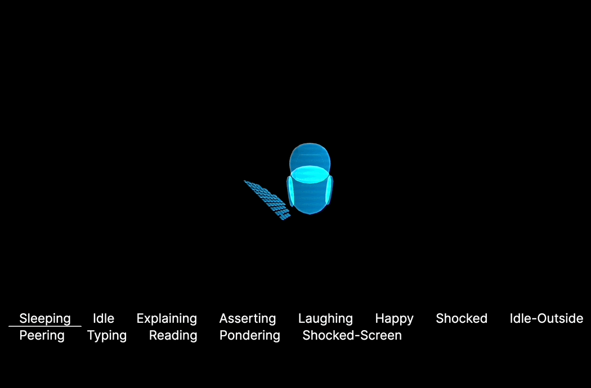

# r3f/Blender Animation Practice

This is a spike to see if I can:

✅ Sculpt,  
✅ Rig,  
✅ Animate,  
✅ And handle smooth transitions between animations



### Install deps
```
yarn
```

### Run server
```
yarn dev
```